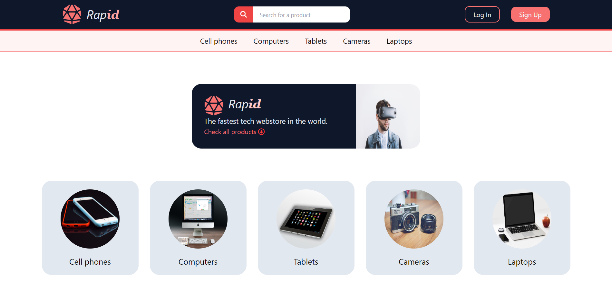
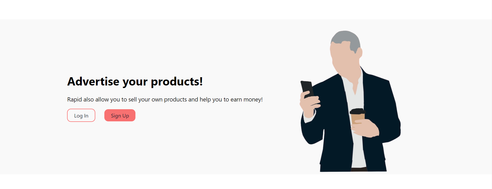
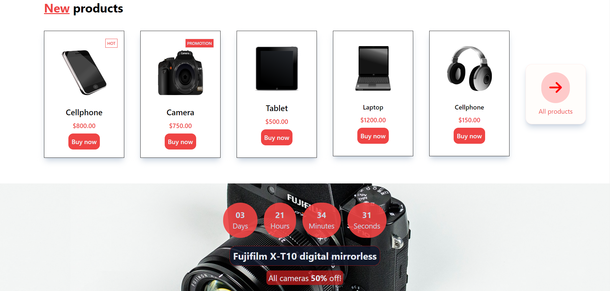
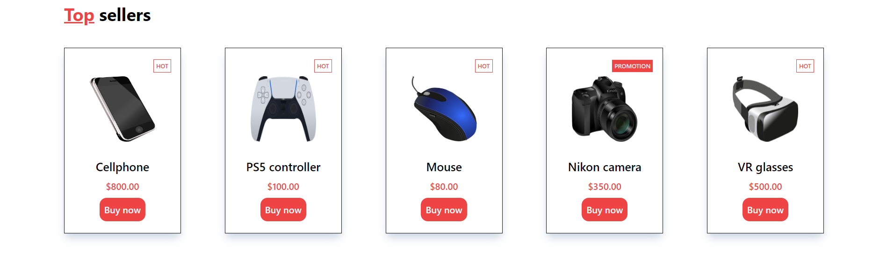
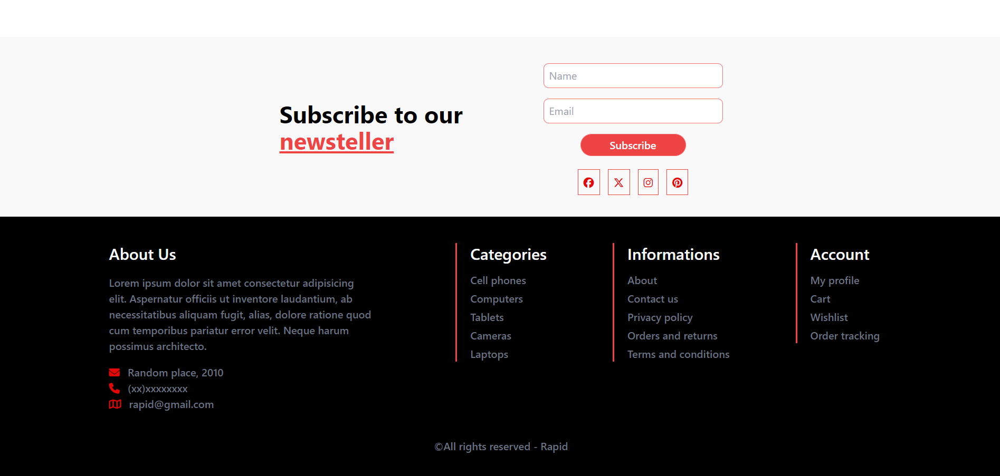

<h1>Rapid</h1>

<h1>Descrição</h1>

O projeto consiste em uma página inicial para um site de e-commerce para uma loja de vendas de eltrônicos fictícia chamada "Rapid". O principal intuito da criação deste projeto foi o de aprimorar habilidades nas tecnologias Tailwind CSS e JavaScript. Durou aproximadamente dois dias para deixá-lo na versão desktop. Em breve, mais versões responsivas estarão disponíveis.

<h1>Funcionalidades e destaques</h1>
<ul>
  <li>Barra de navegação</li>
  <li>Seção de produtos em destaque</li>
  <li>Seção de newsteller</li>
  <li>Flexbox</li>
  <li>Countdown timer</li>
  <li>Mini formulário</li>
  <li>Footer</li>
</ul>

<h1>Imagens demonstrativas</h1>

<h3>Tela principal</h3>

<h3>Banner para as pessoas anunciarem seus produtos</h3>

<h3>Seção de novos produtos e banner de promoção</h3>

<h3>Seção de produtos mais vendidos</h3>

<h3>Seções de newsteller e footer</h3>

<h1>Tecnologias utilizadas</h1>

  
   &nbsp;
   &nbsp;

